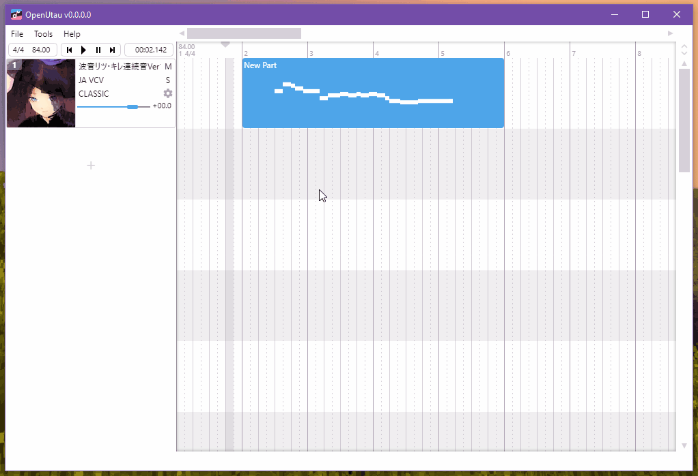
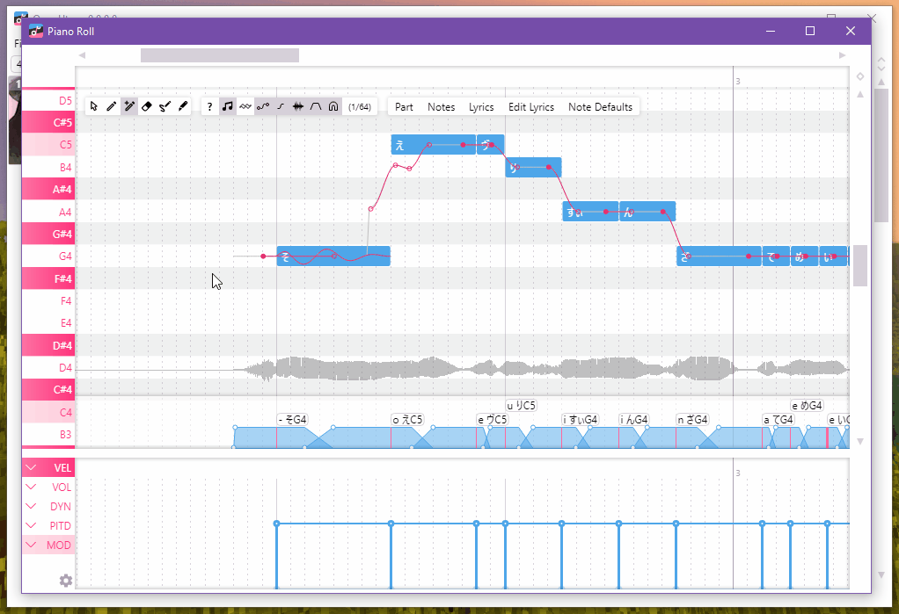
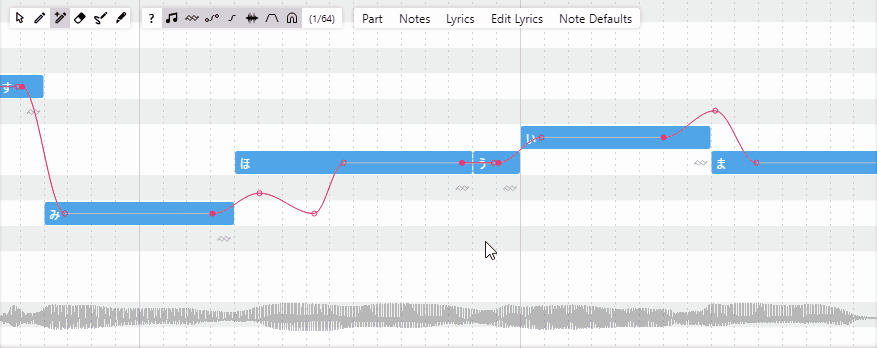
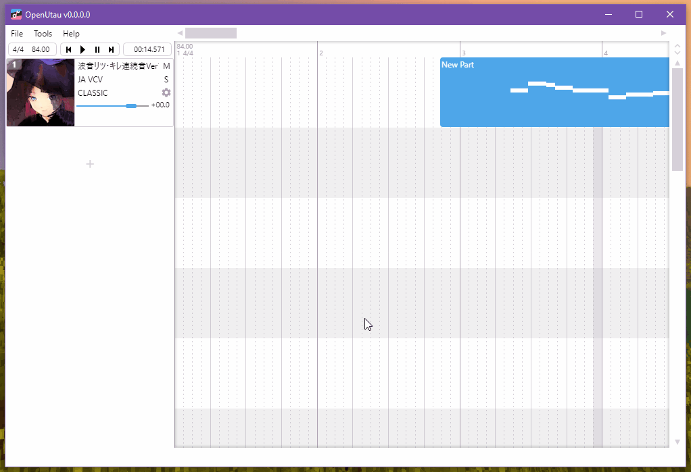

# runit-xze/OpenUtau

This is a **community-maintained fork** of [stakira/OpenUtau](https://github.com/stakira/OpenUtau) with bug fixes and selected upstream PRs merged ahead of the upstream release cycle.

## Downloads

| Platform | Link |
|---|---|
| **Linux x86_64** | [OpenUtau-linux-x86_64.AppImage](https://github.com/runit-xze/OpenUtau/releases/latest/download/OpenUtau-linux-x86_64.AppImage) |
| **Linux aarch64** | [OpenUtau-linux-aarch64.AppImage](https://github.com/runit-xze/OpenUtau/releases/latest/download/OpenUtau-linux-aarch64.AppImage) |
| Windows / macOS | See [upstream releases](https://github.com/stakira/OpenUtau/releases) |

The updater is **disabled in this fork** since the appcast points at upstream releases. Download new builds from this page.

## What's fixed here

See [BACKLOG-TRIAGE.md](BACKLOG-TRIAGE.md) for the full list of merged fixes and triaged upstream issues. Key fixes so far:

- **ONNX static-init poisoning crash** (Preferences, new project, phonemizer select) — PR #58
- **SharpWavtool negative offset** caused audio to stop immediately — PR #59
- **Autosave crash** on unsaved project — PR #60
- **moresampler LLSM directory race** — PR #61
- **Arm64 build support** — onnxruntime package selection fixed for `linux-arm64`
- **Flag text input** from upstream PR #2031 — plus fixes for resampler lookup and build break
- **Load-all-depth-folders** from upstream PR #1535 — respecting the existing preference
- **Spanish+ phonemizer** from upstream PR #2059

## Documentation

For general usage, wiki, and community links, see the [upstream README](https://github.com/stakira/OpenUtau).

## Plugin development

Want to contribute plugins to help other users? Check out our API documentation:
- [Editing Macros API Document](OpenUtau.Core/Editing/README.md)
- [Phonemizers API Document](OpenUtau.Core/Api/README.md)

## Main features

Navigate the interface naturally and fluently using the mouse and scroll wheel. Keyboard shortcuts are also available.

Easily create songs and covers using the feature-rich MIDI editor.

Create expressive vibratos with the easy-to-use vibrato editor.

Pre-rendering and built-in resamplers let you quickly preview your work.

See the [Getting-Started Wiki page](https://github.com/stakira/OpenUtau/wiki/Getting-Started) for more!

## All features
- Modern user experience.
- Easy navigation using the mouse and keyboard.
- Feature-rich MIDI editor.
  - Support for importing VSQX (Vocaloid 4) tracks.
- Selective backward compatibility with UTAU.
  - OpenUtau aims to solve problems with fewer steps. It is not designed to replicate UTAU features exactly.
- Extensible real-time phonetic editing.
  - Includes phonemizers for different phonetic systems (VCV, CVVC, Arpasing, etc.) in many different languages (English, Japanese, Chinese, Korean, Russian and more).
- Expressions replace the standard UTAU "flags" for tuning.
  - The built-in WORLDLINE-R resampler supports curve tuning, similar to many vocal synth editors.
- Internationalisation, including UI translation and file system encoding support.
  - Unlike UTAU, there is no need to change your system locale to use OpenUtau.
- Smooth preview/rendering experience.
  - Pre-rendering allows OpenUtau to render vocals before playback, saving time during editing and tuning.
- Supports ENUNU AI singers. See the [ENUNU wiki page](https://github.com/stakira/OpenUtau/wiki/ENUNU-NNSVS-Support) for more info.
- Easy-to-use plugin system.
- Versatile resampling engine interface.
  - Compatible with most UTAU resamplers.
- Runs on Windows (32/64 bit), macOS, and Linux.

### What it doesn't do
- While OpenUtau can do very minimal mixing, it will not replace your digital audio workstation of choice.
- OpenUtau does not aim for Vocaloid compatibility, except for some limited features.
